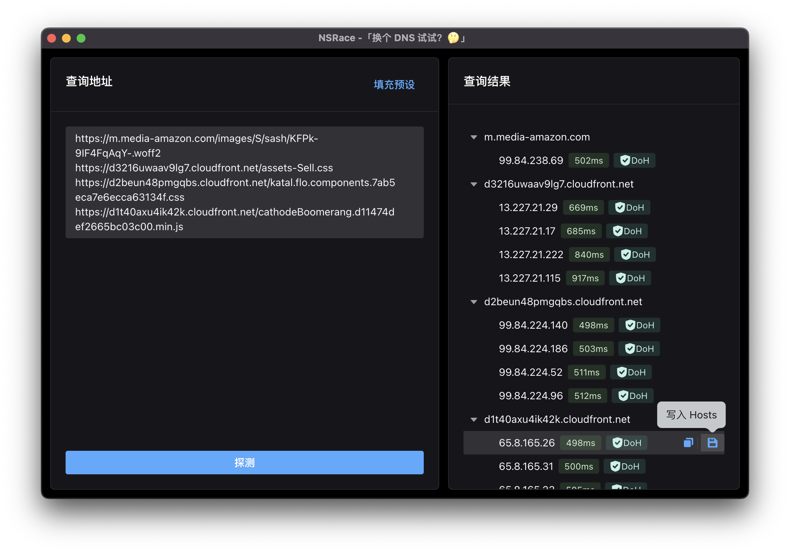

# NSRace for Desktop
> 「换个 DNS 试试？🤔」

## Overview

## Installation
Download https://github.com/imyelo/nsrace-desktop/releases

## Builtins DNS Servers List
Check https://github.com/imyelo/nsrace/blob/master/src/core/config.ts#L7-L31

## Based on
- [nsrace](https://github.com/imyelo/nsrace)
- [electron-vite-react](https://github.com/electron-vite/electron-vite-react)
- [Semi Design](https://github.com/DouyinFE/semi-design)
- [dns2](https://github.com/song940/node-dns)
- [More ...](./package.json)

## License
MIT &copy; [yelo](https://github.com/imyelo)
